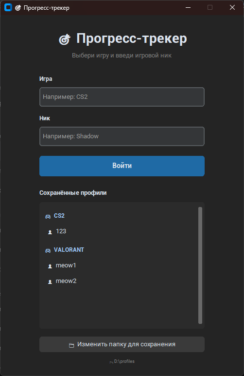
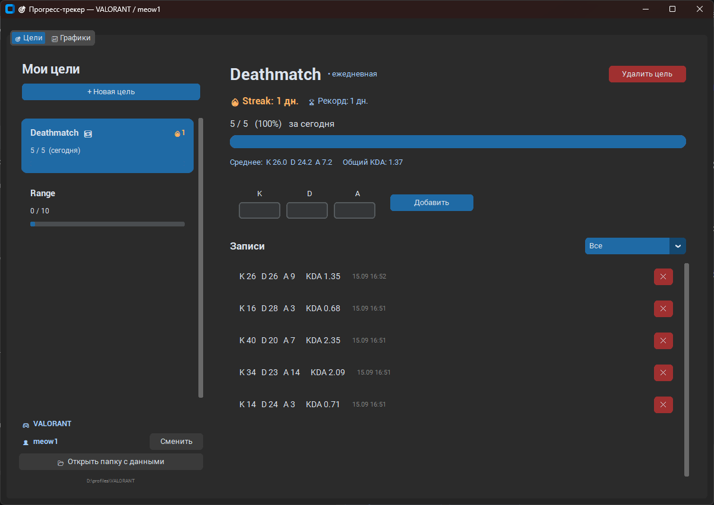
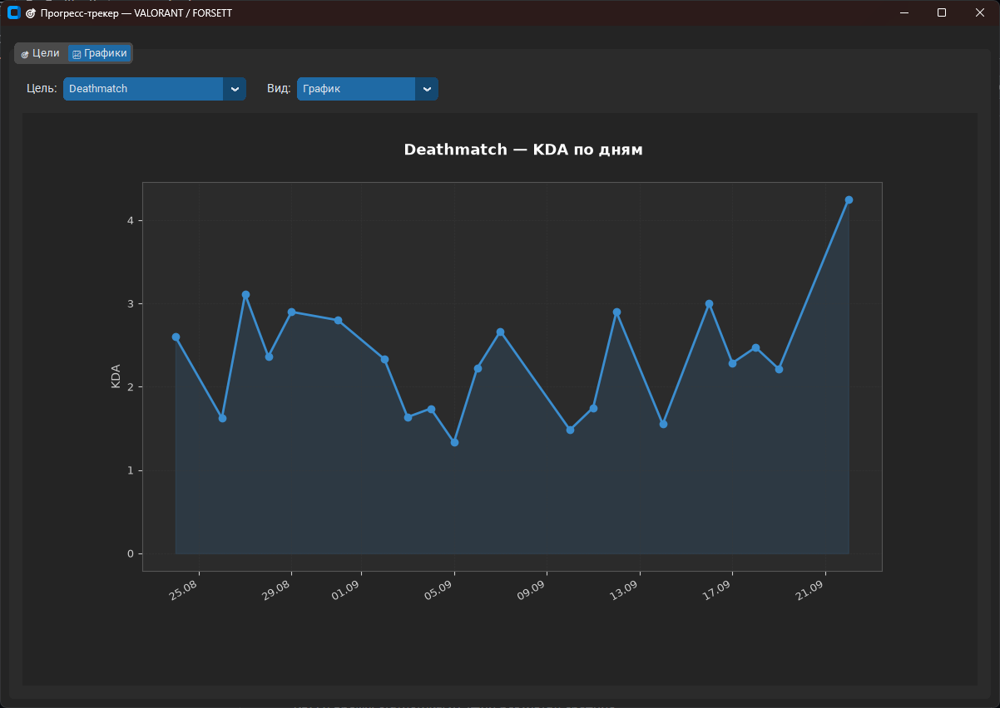
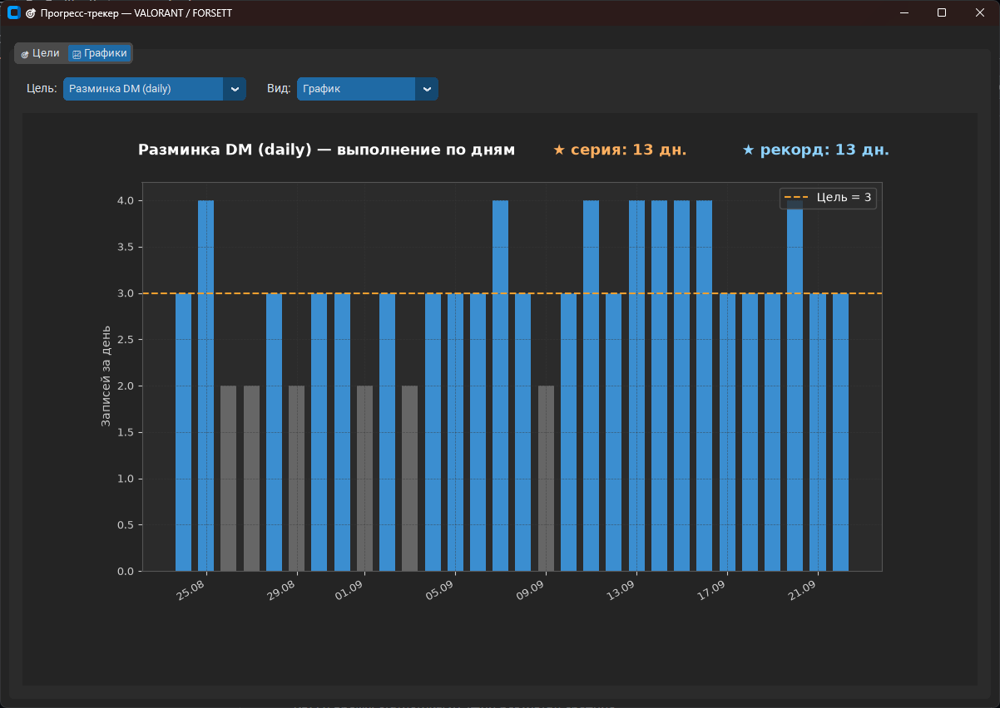
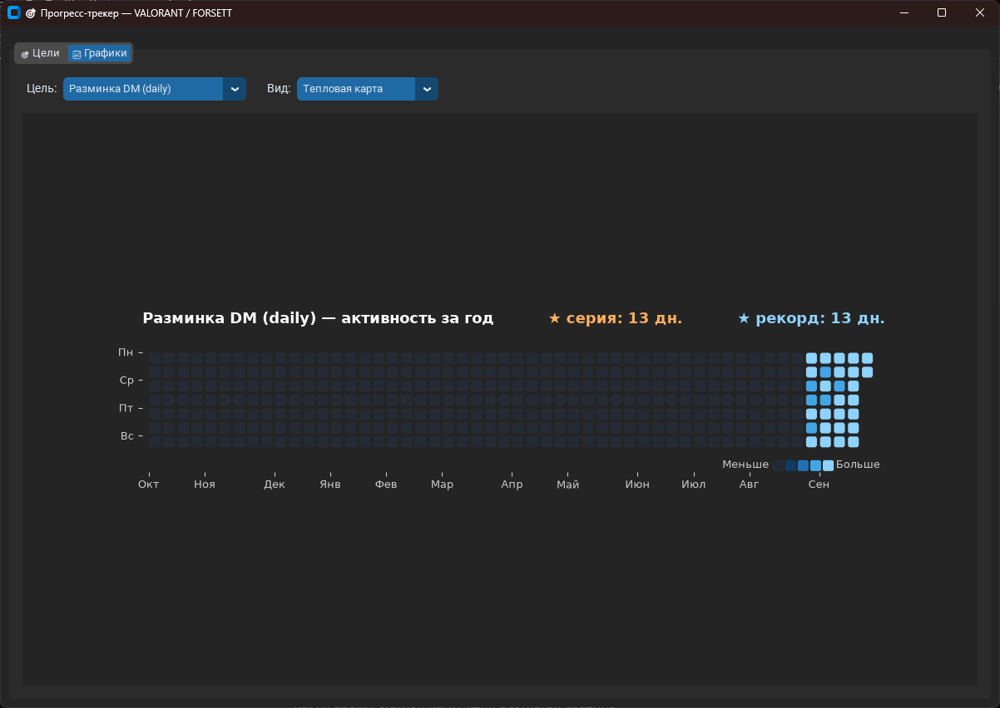
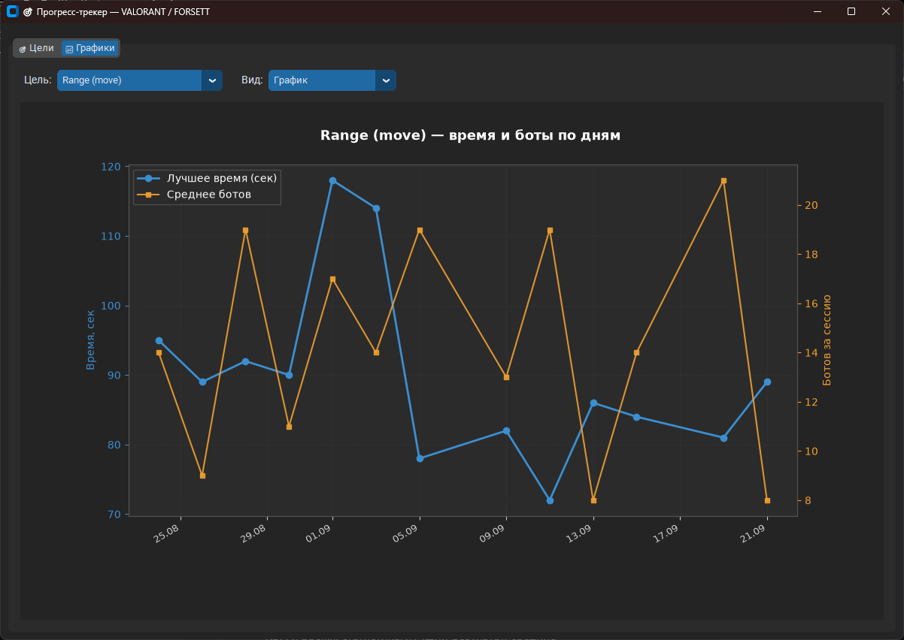

# Прогресс-трекер

Приложение для отслеживания игрового прогресса: цели, KDA, время, стрики и графики.

## Возможности

- Профили по игре и никнейму - возможность ввода нескольких игр и ников
- Разовые и ежедневные цели
- KDA и время: статистика, лучший результат, средние
- Оружие: выбор из списка на каждой записи, список редактируется
- Фильтр по датам: сегодня / 7 дней / 30 дней / конкретный день / свой период
- Графики: динамика KDA, времени и выполнения по дням
- Streak: текущая серия и личный рекорд
- Тепловая карта активности за год
- Локальная база SQLite, без интернета

## Скачать

[**Скачать последнюю версию**](../../releases/latest)

> При первом запуске Windows SmartScreen может предупредить
> о «неизвестном издателе» — это нормально для приложений без платной подписи.
> Нажми **«Подробнее → Всё равно запустить»**.

## Запуск из исходников

Для тех, кто хочет запустить без сборки:

```bash
pip install -r requirements.txt
python tracker.py
```

## Где хранятся данные

Рядом со скриптом (или `.exe`) в папке `data/profiles/<Игра>/<Ник>.db`.

Путь можно изменить кнопкой **«Изменить папку для сохранения»** на экране входа.

## Скриншоты

### Экран входа


### Цели и прогресс


### График KDA


### График ежедневной цели


### Тепловая карта


### График Range (время + количество убитых ботов)

